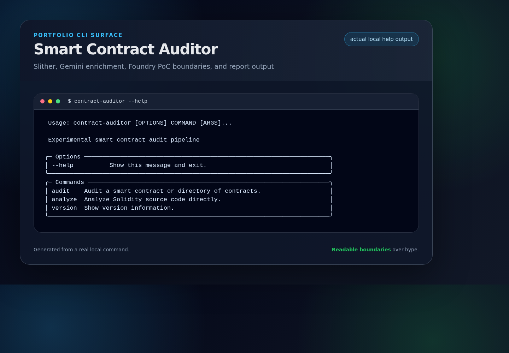
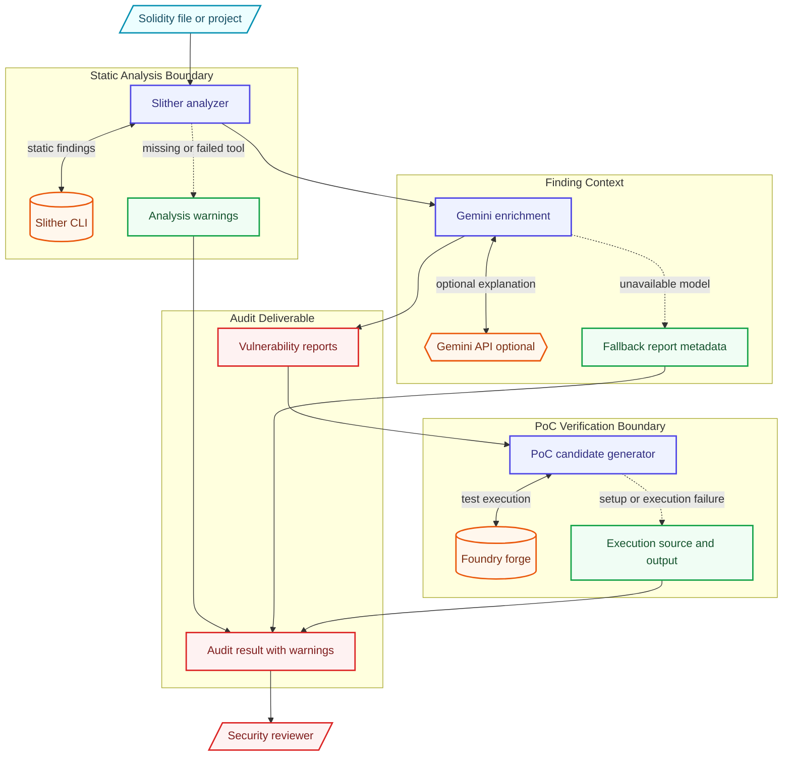

# Smart Contract Auditor

An experimental smart contract security audit pipeline that combines **Slither** static analysis, optional **Gemini** enrichment, and optional **Foundry** Proof of Concept checks.

## Portfolio Showcase



- **Architecture deep dive:** [`docs/ARCHITECTURE.md`](docs/ARCHITECTURE.md)
- **Demo guide:** [`docs/DEMO.md`](docs/DEMO.md)
- **Reviewer focus:** Slither findings, Gemini enrichment, Foundry PoC verification boundaries, and fallback labeling.

## Architecture Overview



## Features

- **Slither Integration**: Runs Slither static analysis for initial vulnerability detection
- **Gemini Enrichment**: Uses Gemini, when configured, to draft vulnerability descriptions, impact analysis, and remediation guidance
- **PoC Generation**: Generates Foundry test cases for high and critical findings when enabled
- **Vulnerability Checks**: Executes generated PoCs and records whether Foundry ran and passed
- **MITRE-style Classification**: Categorizes vulnerabilities into standardized types (Reentrancy, Access Control, etc.)
- **Reporting**: Generates audit reports in Markdown or JSON format

## What Works Today

- Loads Solidity files or directories and sends them through Slither.
- Converts Slither detector output into typed findings and severity counts.
- Optionally asks Gemini to enrich findings with narrative impact/remediation text.
- Optionally generates and runs Foundry tests for high/critical findings.
- Provides explicit metadata when Gemini, Slither, or Foundry cannot complete a step.

## Current Limits

- This is not a replacement for manual review by a smart contract security engineer.
- Gemini-generated descriptions and PoCs may be incomplete or wrong and require review.
- A passing generated Foundry test only shows that one generated scenario passed; it does not prove exploitability with certainty.
- Slither coverage depends on the installed Slither version, compiler setup, project layout, and dependency resolution.

## Dependency Behavior

- `AUDIT_MOCK_MODE=true` uses deterministic demo data and does not contact Slither, Gemini, or Foundry. Mock successes are for tests/demos only.
- Missing or failing Slither runs preserve API compatibility by returning no findings, but audit results include `analysis_warnings` and logs include target/path context.
- Missing or failing Gemini enrichment returns a fallback report with `enrichment_source="fallback"` and an `enrichment_error` message.
- Missing or failing Gemini PoC generation returns a placeholder PoC with `generation_source="fallback"` and a `generation_error` message.
- Missing or failing Foundry setup/execution marks the PoC as unsuccessful and includes the failure in `execution_output`.

## Safety/Verification Boundaries

- Treat all output as triage assistance, not an audit certificate.
- Verify findings against source code, compiler settings, deployment assumptions, and protocol context.
- Do not treat mock mode output as real security evidence.
- Review generated PoCs before running them against real projects or live infrastructure.

## Installation

### Prerequisites

- Python 3.11+
- Slither (pip install slither-analyzer)
- Foundry (forge, cast, anvil)
- Gemini API key

### Quick Start

```bash
# Clone the repository
git clone https://github.com/lord-dubious/smart-contract-auditor.git
cd smart-contract-auditor

# Create virtual environment
uv venv
source .venv/bin/activate

# Install dependencies
uv pip install -e ".[dev]"

# Set up environment
cp .env.example .env
# Edit .env with your GEMINI_API_KEY

# Run tests
pytest tests/ -v
```

### Install Slither

```bash
pip install slither-analyzer
```

### Install Foundry

```bash
curl -L https://foundry.paradigm.xyz | bash
foundryup
```

## Usage

### CLI Commands

```bash
# Audit a single Solidity file
contract-auditor audit contracts/Vault.sol

# Audit a directory
contract-auditor audit ./contracts/

# Audit with specific severity threshold
contract-auditor audit contracts/ --severity high

# Generate JSON report
contract-auditor audit contracts/ --format json --output report.json

# Skip PoC generation
contract-auditor audit contracts/ --no-poc

# Analyze source code directly
contract-auditor analyze "contract Foo { function bar() external { } }"
```

### Python API

```python
from contract_auditor import (
    ContractAuditor,
    create_auditor,
    AuditConfig,
    Severity,
)

# Create auditor with configuration
config = AuditConfig(
    gemini_api_key="your-api-key",
    severity_threshold=Severity.MEDIUM,
    generate_poc=True,
)

auditor = create_auditor(config)

# Audit a file
result = await auditor.audit_file("contracts/Vault.sol")

# Print summary
print(f"Total findings: {result.total_findings}")
print(f"Critical: {result.critical_count}")
print(f"High: {result.high_count}")
print(f"Verified exploits: {result.successful_exploits}")

# Generate report
report = auditor.generate_report(result, format="markdown")
print(report)
```

## Vulnerability Types Detected

| Type | Description |
|------|-------------|
| Reentrancy | External calls before state updates |
| Unchecked Call | Return values not checked |
| Access Control | Missing or weak authorization |
| Integer Overflow/Underflow | Arithmetic vulnerabilities |
| Front Running | Transaction ordering exploits |
| Flash Loan | Flash loan attack vectors |
| Oracle Manipulation | Price oracle vulnerabilities |
| Delegatecall | Unsafe delegatecall usage |
| Self-destruct | Unprotected selfdestruct |
| tx.origin | Authentication using tx.origin |

## Sample Output

```
┌──────────────────────────────────────────────────────────────┐
│                       Audit Summary                          │
├──────────────────────────────────────────────────────────────┤
│ Audit ID: abc123def456                                       │
│ Duration: 5.23s                                              │
│ Contracts: 3                                                 │
│ Total Findings: 5                                            │
└──────────────────────────────────────────────────────────────┘

┌───────────────────────────────────────┐
│        Severity Breakdown             │
├───────────────┬───────────────────────┤
│ Severity      │ Count                 │
├───────────────┼───────────────────────┤
│ Critical      │ 1                     │
│ High          │ 2                     │
│ Medium        │ 1                     │
│ Low           │ 1                     │
└───────────────┴───────────────────────┘

┌────────────────────────────────────────────────────────────────────────────┐
│                          Vulnerabilities Found                              │
├────┬──────────┬─────────────────┬──────────────────────────┬───────────────┤
│ #  │ Severity │ Type            │ Title                    │ Contract      │
├────┼──────────┼─────────────────┼──────────────────────────┼───────────────┤
│ 1  │ HIGH     │ reentrancy      │ Reentrancy in withdraw   │ Vault         │
│ 2  │ HIGH     │ arbitrary-send  │ ETH sent to arbitrary... │ Payment       │
│ 3  │ MEDIUM   │ unchecked-call  │ Unchecked transfer       │ Token         │
└────┴──────────┴─────────────────┴──────────────────────────┴───────────────┘
```

## Configuration

| Environment Variable | Description | Default |
|---------------------|-------------|---------|
| `GEMINI_API_KEY` | Google Gemini API key | Required |
| `AUDIT_SLITHER_PATH` | Path to Slither binary | `slither` |
| `AUDIT_FORGE_PATH` | Path to Forge binary | `forge` |
| `AUDIT_SEVERITY_THRESHOLD` | Minimum severity to report | `medium` |
| `AUDIT_GENERATE_POC` | Generate PoC exploits | `true` |
| `AUDIT_MAX_CONTRACTS` | Max contracts per audit | `10` |
| `AUDIT_MOCK_MODE` | Use deterministic mock/demo data instead of external tools | `false` |

## Project Structure

```
smart-contract-auditor/
├── src/contract_auditor/
│   ├── __init__.py        # Package exports
│   ├── models.py          # Pydantic data models
│   ├── analyzer.py        # Slither wrapper
│   ├── enricher.py        # Gemini vulnerability enrichment
│   ├── poc_generator.py   # Foundry PoC generation
│   ├── auditor.py         # Main orchestrator
│   └── cli.py             # Typer CLI
├── tests/
│   ├── conftest.py        # Test fixtures
│   ├── test_models.py     # Model tests
│   ├── test_analyzer.py   # Analyzer tests
│   ├── test_enricher.py   # Enricher tests
│   ├── test_poc_generator.py  # PoC generator tests
│   ├── test_auditor.py    # Auditor integration tests
│   └── test_cli.py        # CLI tests
├── docker-compose.yml
├── Dockerfile
└── pyproject.toml
```

## Testing

```bash
# Run all tests
pytest tests/ -v

# Run with coverage
pytest tests/ -v --cov=contract_auditor --cov-report=html

# Run specific test file
pytest tests/test_analyzer.py -v

# Run in mock mode (no external dependencies)
pytest tests/ -v -k "mock"
```

## Contributing

1. Fork the repository
2. Create a feature branch (`git checkout -b feature/amazing-feature`)
3. Run tests (`pytest tests/ -v`)
4. Commit changes (`git commit -m 'Add amazing feature'`)
5. Push to branch (`git push origin feature/amazing-feature`)
6. Open a Pull Request

## License

MIT License - see [LICENSE](LICENSE) for details.

## Acknowledgments

- [Slither](https://github.com/crytic/slither) - Smart contract static analyzer
- [Foundry](https://github.com/foundry-rs/foundry) - Ethereum development toolkit
- [Google Gemini](https://ai.google.dev/) - AI language model
