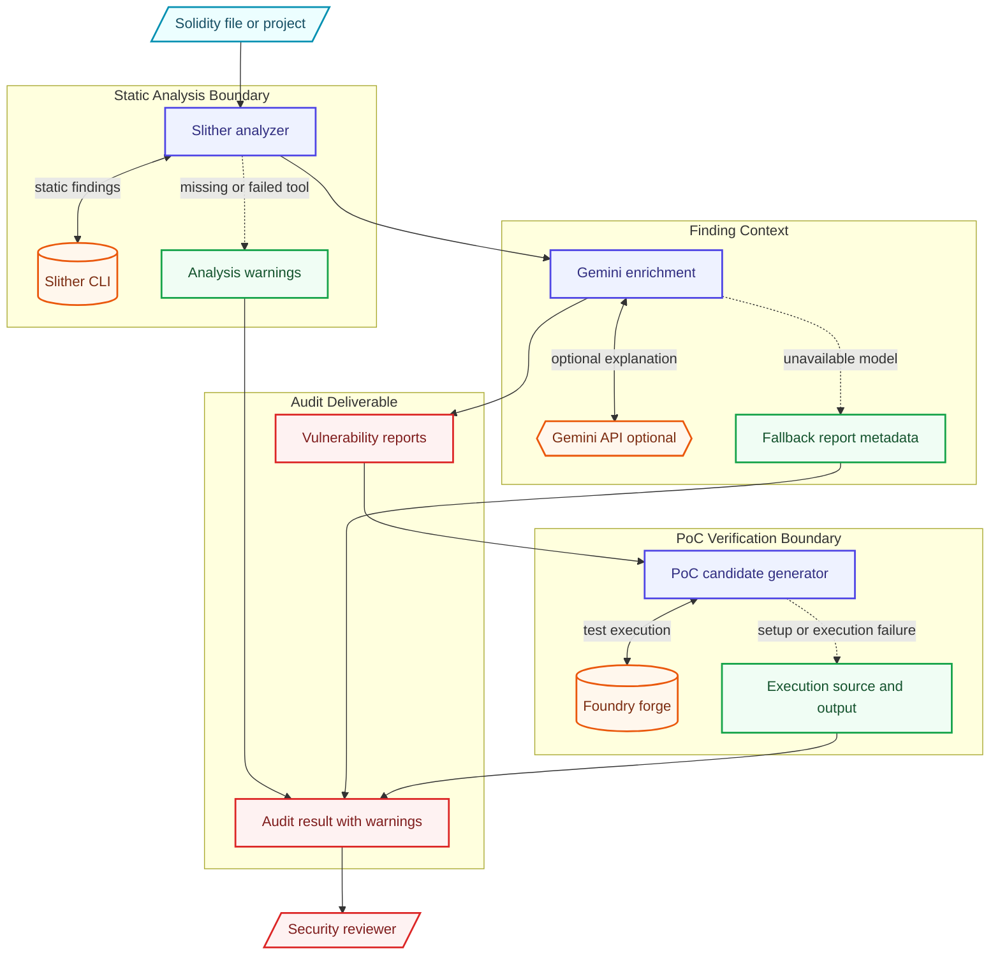

# Architecture

Experimental audit pipeline that combines Slither findings, Gemini enrichment, Foundry PoC execution, and explicit verification/fallback boundaries.

This document is written for reviewers who want to understand how the project is shaped before reading the code. It emphasizes boundaries, dependencies, and degraded paths rather than marketing claims.

## Data Flow

1. Solidity source
2. Slither analysis
3. Gemini enrichment or fallback report
4. Foundry PoC generation/execution
5. Audit report with warnings

## Main Components

- **Slither analyzer**: Runs static analysis and records analysis warnings when tooling is unavailable.
- **Enricher**: Adds Gemini context while labeling mock/fallback/gemini sources.
- **PoC generator**: Creates exploit candidates and records generation/execution source and errors.
- **CLI/reporting**: Presents findings with limitations and verification boundaries.

## External Dependencies

- Python 3.11+
- Slither
- Foundry
- Optional Gemini API key
- Solidity projects suitable for local analysis

The project is intentionally explicit about optional services. Mock, fallback, and degraded paths are labeled in result metadata so a demo cannot be mistaken for a successful production integration.

## Failure And Degraded Modes

- External-service failures are captured as warnings, status fields, or source metadata where the domain model supports it.
- Mock/demo behavior is opt-in or explicitly labeled.
- Generated outputs are treated as review candidates, not authoritative decisions.
- CLI output remains user-facing; library internals use logging or structured metadata.

## What To Review In Code

- Missing Slither/Foundry/Gemini paths no longer look like successful verification.
- Fallback reports and PoCs include source/error metadata.
- Docs explain what the tool can and cannot prove.

## Current Limits

- This is not a substitute for a professional security audit.
- Generated PoCs require manual review.
- Tool output depends on Slither/Foundry availability and project configuration.
